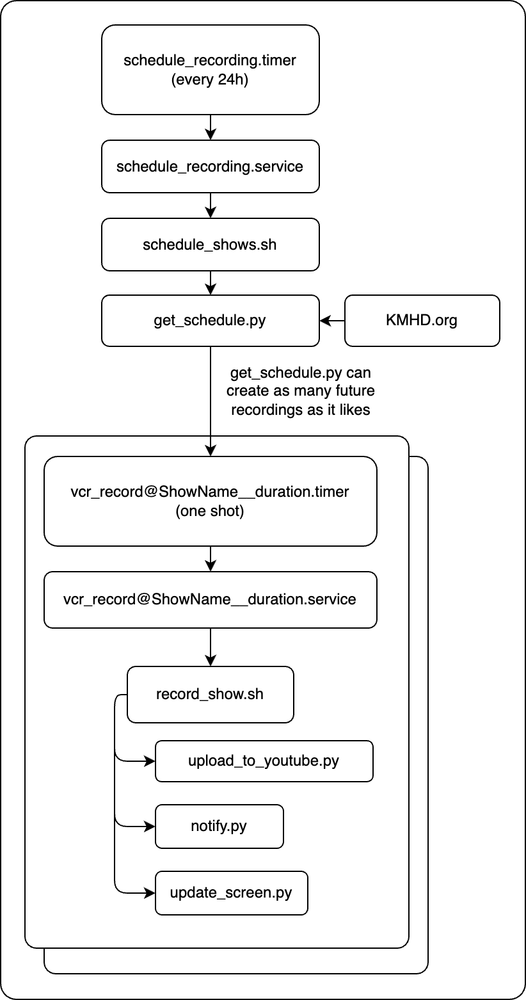

# radio_vcr
Record KMHD shows while you sleep! 

Do you listen to [KMHD](https://www.kmhd.org/give/) on an analog radio at home and wish you could listen to late-night broadcasts that aren't posted online anywhere?

Well then you must be me! Good! Because this code isn't portable and I'm only uploading it here in case my pi gets fried or something.

 

# What is it?

It's a little systemd-based Rube Goldberg Machine to scrape the KMHD website and trigger audio capture when selected programs are on the air.

Execution flow:
 * `schedule_recording.timer` triggers once a day (edit it to change when)
 * the timer triggers `schedule_recording.service` to run `schedule_shows.sh`
 * `schedule_shows.sh` runs the python script `get_schedule.py` using the project virtual environment and passes all its output to bash to run as commands
 * `get_schedule.py` outputs one command per line of the form `sytemd-run --user --on-calendar ... --unit vcr_record@Title__123.service`
 * the `vcr_record@.service` runs `record_show.sh` which makes the recording and uploads it to Youtube Music

## Flow Control

# Hardware

* [Raspberry Pi 5](https://www.raspberrypi.com/products/raspberry-pi-5/)
  * Any linux machine will work
* [Behringer UCA202](https://www.behringer.com/product.html?modelCode=0805-AAC)
  * Any audio input will work, I chose this because I needed RCA inputs

# Setup

`sudo apt-get install sox libsox-fmt-mp3`

`python -m venv .venv`

`source .venv/bin/activate`

`pip install bs4 ytmusicapi pushbullet.py`

`ytmusicapi browser`
  Follow instructions from https://ytmusicapi.readthedocs.io/en/stable/setup/browser.html

`./schedule_shows.py --get_shows > my_shows.ini`
  Edit `my_shows.ini`, to leave just the list you're interested in

`deactivate`

`cp pushbullet_token.py.template pushbullet_token.py`
  Add your pushbullet API key to the file

`cp systemd_units/* ~/.config/systemd/user/`

`systemctl --user start schedule_recording.timer`

`sudo loginctl enable-linger $SUDO_USER`
